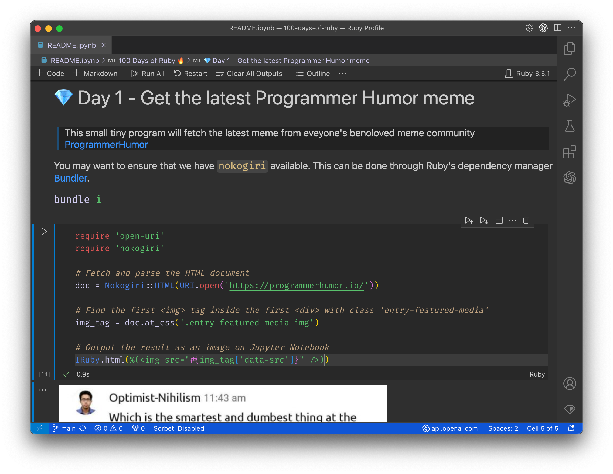

# 100 Days of Ruby 🔥

Start here 👉 [Ruby Jupyter Notebook](README.ipynb)

## How does this work?

I will be writing cool and fun programs every day in Ruby using Jupyter Notebook. I'll also write longer articles on my [blog](https://ashgaikwad.substack.com/) explaining details of how some of these things work. 

### What if you have questions?
If you have any questions, you can reach out to me on GitHub by creating an issue OR on my [blog](https://ashgaikwad.substack.com/) by commenting.

## Want to setup Ruby with Jupyter?

Here you can read detailed instructions on how to set it up: [How to setup VS Code to use Ruby in Jupyter Notebook](https://open.substack.com/pub/ashgaikwad/p/how-to-setup-vs-code-to-use-ruby?r=30riyy&utm_campaign=post&utm_medium=web)

You may also want to enhance full potential of VS Code for overall Ruby programming. Here is another short article on that: [Setup VS Code for Ruby programming (theme, Ruby LSP, formatting...)](https://open.substack.com/pub/ashgaikwad/p/how-to-setup-vs-code-for-ruby?r=30riyy&utm_campaign=post&utm_medium=web)